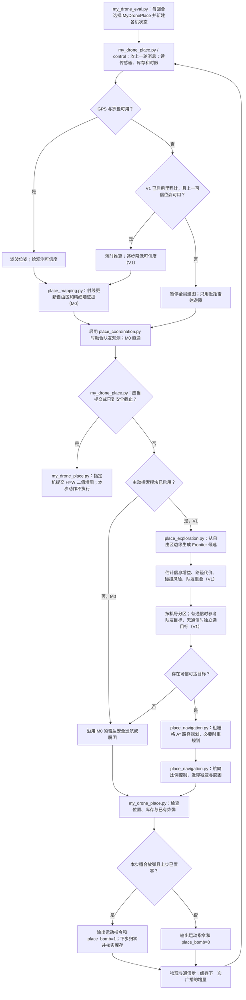

# 红队首版算法方案：从真实建图到多机探索

> 设计与进度，2026-09-28。**M0 传感器建图基线已实现并通过本地仿真；V1 主动探索与多机协作仍是计划。**对象是 `place` 模式的红队，不假设正式评测会使用本地 `Map01` 或固定无人机数量。

## 1. 先解决什么问题

红队入口 `src/swarm_rescue/solutions/my_drone_eval.py` 返回 `MyDronePlace`。原始示例会巡航、定时尝试放弹，却提交随机墙图。当前 M0 已在 `MyDronePlace` 中改为累积 GPS、罗盘和 Lidar 观测，并在回合结束前提交真实传感器推得的墙图；巡航与定时放弹暂沿用示例。地图准确度占红队分数 **50%**，所以先验证这条闭环。

红队另外有炸弹难度 20%、炸墙 20%、时间 10%。其中炸弹难度要由参考蓝队运行后才能评价，本地红队仿真先给出最高 80 分的部分分。首版先保持“能放、能核实、能结束”，再优化放置位置。地图不能照抄 `src/swarm_rescue/maps/`、读取仿真真值或预存正式地图；这些文件仅可用于理解框架和**离线**核对算法结果。

这里说的“建图”首先是**有噪声 GPS/罗盘辅助的二维占据建图**。它用多次测量拼接地图，但还不是完整的无 GPS SLAM。等这个闭环可靠，再考虑里程计融合、回环修正等真正需要解决定位漂移的问题。强化学习、三维重建、LQR/MPC 均不列入第一版。

## 2. 数据和规则边界

| 信息或动作 | 首版如何使用 | 理论或实现注意点 |
| --- | --- | --- |
| `measured_gps_position()`、`measured_compass_angle()` | 得到带噪声的世界位姿 $(x,y,\theta)$ | 可能返回 `None`；不能用 `true_position()` 等真值补洞。 |
| `lidar_values()`、`lidar_rays_angles()` | 从机体相对角和距离推算自由射线及可能的墙端点 | 角度须加机体朝向；最大量程附近不能直接断定有墙。语义传感器不负责量测墙。 |
| `odometer_values()` | V1 才尝试在 GPS/罗盘缺失时短时推算 | M0 先暂停全局墙图更新、继续近距避障；推算误差会累积，必须标记低可信度。 |
| `communicator.received_messages` | 接收队友位置、目标、库存、地图增量和时间戳 | 通信半径 250 像素；禁通信区或距离过远时收不到。失联不代表无人机失控。 |
| `control()` 返回指令 | `forward`/`lateral`/`rotation` 控制运动，`grasper=0`，`place_bomb` 按需触发 | 控制量是推力/角速度指令，有惯性；碰撞损失生命。放弹只在 $0\to1$ 上升沿触发，可能静默失败。 |
| `submit_exploration_map(grid)` | 提交形状为 $(H,W)$ 的二值墙图 | **调用即结束本回合，且本步运动/放弹指令不会执行。** 地图为 1 像素/格；只能画可信的真实墙，处置中心等不算墙。 |

坐标换算按文档：

$$
\begin{aligned}
\mathrm{col} &= \operatorname{round}(x + W/2), \\
\mathrm{row} &= \operatorname{round}(-y + H/2).
\end{aligned}
$$

内部保留“未知”状态以规划探索，但提交接口只有 `0/1`；未知区域在提交图中为 `0`，并不表示真的已探索。**不要把 8 像素导航栅格直接放大后提交**，墙边会变粗、错位并受误画惩罚。

通信还有独立的距离约束：两机通信器均可用、实际距离 $d<250\,\mathrm{px}$ 时才可能直接收到消息；$d\ge 250\,\mathrm{px}$ 时，即使两机都不在禁通信区，也收不到。任意一机的通信器被 `NoComZone` 禁用时，本次通信同样失败。当前通信器只按两机距离判断，没有墙体遮挡判定，也不会自动经第三架无人机中继；需要中继时必须由策略自己转发消息。

每个回合都会重新创建无人机实例；每个仿真步先收集各机 `define_message_for_all()` 的消息，再调用各机 `control()`，然后执行物理和通信步骤。因此当前步建好的地图增量只能在**下一次**广播中发出。一个回合中所有无人机是各自决策，不存在天然共享的中央内存；0 号机只是我们约定的主要提交者，其他无人机照常自主运动。

## 3. 首版完整流程图

图中 **M0** 是第一份可运行代码；**V1** 表示随后接上的主动探索、分工和放置决策。箭头返回“下一步”表示每个仿真步都重新感知和决策，目标/路径不必每步重算。



**顺序上的关键细节：**提交判断必须先于本步放弹，因为提交会使本步命令失效；最后一次放弹应等库存变化确认后，再安排提交。通信在短距离内有效，却不保证全队消息同时到达；不能把“某一步没收到消息”解释成对方已放完或已经死亡。

## 4. 各算法做什么

### 4.1 位姿与地图：回答“我在哪里、墙在哪里”

先用 GPS、罗盘给每束雷达射线一个世界方向：$\theta_{\mathrm{ray}}=\theta_{\mathrm{compass}}+\alpha_{\mathrm{lidar}}$。从测量位姿沿射线走过的格子增加“空闲”证据；只有可信的有效回波端点增加“墙”证据。用**占据栅格 / 逆传感器模型**累积多次带噪声观测，可把每格占据证据表示成对数几率（log-odds）：

$$
L_t(c)=\operatorname{clip}\!\left(L_{t-1}(c)+\Delta L_t(c),\,L_{\min},\,L_{\max}\right).
$$

其中 $c$ 是地图格子，$t$ 是观测步，$\Delta L_t(c)$ 是本次测量给它增加的“墙证据”。通常从 $L=0$（暂时拿不准）开始：正数偏向墙，负数偏向空地；$L$ 不是墙的位置。若墙的概率为 $p$，则 $L=\ln\bigl(p/(1-p)\bigr)$；改用这个分数，反复观测时只需加减证据。$\operatorname{clip}(z,a,b)=\min(\max(z,a),b)$ 表示把结果限制在 $[a,b]$：例如上限为 $2$、旧分数 $1.7$ 再加 $0.7$，本次只记 $2$，后续的空地证据仍能使它下降。这些数值只是示意，实际参数尚未确定。

M0 先按 1 像素/格保存墙的端点与空闲证据；V1 计划另加约 8 像素/格的导航层表示“未知、可通行、占据”，以降低规划开销。建议从低置信度、稀疏的墙线开始，按本地 `_exploration_diff.png` 的漏墙与误画图调阈值。已知静态墙如果反复被“自由”观测穿过，应降低旧证据；“会消失的墙”或其他动态现象先通过重观测处理，暂不专门建立动态地图。

### 4.2 探索与分工：回答“下一步去哪”

**Frontier（前沿）**是“已知可通行格子与未知格子相接的边界”。选一个能够从当前已知自由区抵达的前沿，而不是给未知区域中的某个点强行规划路线。候选目标可用一个可调效用衡量：

$$
U_{ij}=w_gG_{ij}-w_dD_{ij}-w_rR_{ij}-w_oO_{ij}.
$$

这里 $i$ 是无人机、$j$ 是前沿；$G,D,R,O$ 分别表示预计新观测面积、路径长度、风险、与队友目标重叠程度，$w$ 是各项权重。最初不求全局最优：按无人机 ID 给不同方向/区域较高优先级，再从**本机可达**目标里选效用最高者；收到队友近期目标则降低重复探索的目标分数。断联时保留既定区域和本地地图继续工作。等测出明显重复覆盖后，再尝试竞价、匈牙利匹配或更复杂的多机器人任务分配。通信负载以**近期小块地图增量 + 目标/库存/时间戳**为主，不每步广播整幅地图。

### 4.3 导航与控制：回答“怎么安全到达”

在导航栅格上先给墙做一定距离的**膨胀**（把无人机半径和安全余量算进去），再用 A* 搜索到目标附近的已知自由区。A* 会同时考虑已经走过的代价和离目标还需多少代价的估计，因此带有启发性，但不是只盯着目标的纯贪心。目标变化、路径被新墙挡住或卡住时才重规划。沿航点飞行时，用航向误差的比例控制产生旋转指令；误差大时减小前推力，离墙近时减速，紧急时由近距 Lidar 避障覆盖原指令。用数步内位移过小识别“卡住”，短暂后退/侧移、转向，再选路。首版无需精调完整 PID，也无需先做 MPC。

### 4.4 放弹与提交：回答“什么时候完成任务”

M0 沿用示例的定时放弹尝试，同时持续读取库存；失败不会扣库存，后续仍会重试，通常只在确认全队库存为零后提交（安全截止除外）。V1 在已有墙图上用“新炸墙覆盖”作为候选位置的一个可观测代理：尽量靠近多段墙、避开已有炸弹重叠覆盖、保留与其他炸弹至少 24 像素间距，并考虑到达代价与回合剩余时间。它不等于真实“蓝队拆弹难度”——这一项必须由后续参考蓝队测试验证；不要凭直觉断言某种放法一定让蓝队更难。

主要提交者暂定 0 号机：在收到**带时间戳的**全队库存零报告，且最后放弹已核实之后提交。失联或 0 号机损毁可能让此条件无法满足，所以还需在时限前保留安全截止：由确定性的备选机号顺序错开提交时刻，优先保存已有墙图，避免空手跑到超时。阈值按运行数据调，不能只写死 `Map01` 的 2000 步、90 秒；尽量从回合传入的时限读取。队友地图汇聚不全时，提交者只能基于自己收到的观测提交，不能假定获得了所有无人机的完整地图。

## 5. 计划改动哪些文件，以及先后顺序

计划新增的 Python 模块都放在 `src/swarm_rescue/solutions/`，由现有入口引用，并在打包时位于 zip 根层级；这份设计文档不属于提交包。下面是**计划结构**，文件尚不存在的名字只是设计，不代表已经实现：

| 阶段 | 文件 / 方法 | 本阶段的最小结果 |
| --- | --- | --- |
| 已有入口 | `src/swarm_rescue/solutions/my_drone_eval.py` → `drone_class_for_mode("place")` | 保持返回现有 `MyDronePlace`，不改变蓝队入口。 |
| **M0：已实现** | `my_drone_place.py` → `control()`；`place_mapping.py` → `WallEvidenceMap` | GPS、罗盘和 Lidar 累积本机墙证据；继承示例的通信、巡航和定时放弹；用库存与时限决定提交。没有调用 `super().control()`，避免提交随机图。M0 尚不合并队友地图。 |
| **V1a：主动探索** | 拟增 `place_exploration.py`、`place_navigation.py` | 前沿选点、粗栅格 A*、比例控制、近距避障、卡住恢复，替换盲巡航。 |
| **V1b：协作与放置** | 拟增 `place_coordination.py`、`place_placement.py` | 通信地图增量与目标、断联回退、炸墙覆盖启发式、备选提交者。 |
| 后续研究 | 上述模块按需要扩展 | 若无 GPS 场景确实造成明显失分，再投入更多 SLAM/融合；若启发式稳定后仍有瓶颈，才比较 RL、MPC 等方案。 |

M0 的成功定义是**能在比赛模式完整跑完、提交正确尺寸的非随机墙图，且地图分/误检指标相对原始随机示例明显改善**。V1 的成功定义是**多机实际分散探索，能到达新前沿、不会长期撞墙/绕圈，断联仍能运行，炸弹放置数和有效墙覆盖不因探索策略大幅下降**。每加一个模块，只和前一版比较，不一次改完再猜是哪一环有效。

## 6. 怎样评价，而不是只看“跑起来了”

1. 先保留当前 `dev` 行为的本地基线；使用同一评估配置与多回合记录每轮地图、炸墙、时间分、实际放弹数、库存、是否提交、是否崩溃。评估计划当前是 `Map01`、5 机、每机 2 弹、2 回合、无干扰区；它只是本地起点，不足以代表隐藏场景。
2. M0 做**地图单项对照**：检查提交文件尺寸 $(H,W)$、墙面命中、远离真墙的误画、地图分，以及实际回合结束原因。不要只看总分：本地炸弹难度项仍未计算。
3. V1a 做探索对照：每机新观察区域、重复覆盖、撞墙次数/健康值、到达新前沿比例、脱困次数、执行时间。A* 和通信逻辑应按事件触发，不能让 WSL 环境每步计算拖到墙钟时限。
4. V1b 做鲁棒性对照：换不同地图/无人机数量与出生朝向，加入禁 GPS/禁通信区；核对失联、0 号机失效、无可达前沿、库存放弹失败、快超时等情况。最后运行 `./check_submission.sh` 静态检查，并在 `--competition` 模式实际跑完整回合。

M0 的本地验证命令：

```bash
.venv/bin/python -m swarm_rescue.launcher --competition --headless -c config/competition_place_eval_plan.yml
```

2026-09-28 在 WSL 对本地 `Map01` 的两回合验证中，M0 地图分为 17.9% / 29.1%，两轮都放下 10/10 枚炸弹，均在第 840 步提交。分数受各机尚未共享墙图与随机巡航影响，不代表正式评测成绩；炸弹难度分仍待参考蓝队计算。可对照 `results_swarm_rescue/` 下的 `_exploration.json`、`_exploration_diff.png`、`_wall_destruction.png` 和炸弹记录；具体文件以本次运行实际生成结果为准。**地图分提高后仍要看炸墙和时间的权衡**：探索太久会损失时间分，太早提交又会损失地图覆盖。

## 7. 阅读顺序与依据

先理解仓库里的 [`my_drone_place_example.py`](../../src/swarm_rescue/solutions/my_drone_place_example.py)（现有行为）、[`example_mapping.py`](../../examples/example_mapping.py)（占据建图演示）、[`02-队伍开发指南.md`](../participants/02-队伍开发指南.md) §3–7（合法 API 和评分），最后看 [`place_score_manager.py`](../../src/swarm_rescue/simulation/reporting/place_score_manager.py) 与 [`map_exploration_scoring.py`](../../src/swarm_rescue/tools/map_exploration_scoring.py)（本地分数实际如何算）。

想补理论时，只需抓住三条主线：**占据栅格**解释如何累积有噪声射线；**前沿探索**解释去哪看新区域；**多机器人目标分配**解释怎样减少重复。对应的原始研究可选读 [Yamauchi，Frontier-Based Exploration（1997）](https://www.cs.cmu.edu/~motionplanning/papers/sbp_papers/integrated1/yamauchi_frontiers.pdf) 和 [Burgard 等，Coordinated Multi-Robot Exploration（2005）](https://www.ipb.uni-bonn.de/wp-content/papercite-data/pdf/burgard05tro.pdf)。这些是设计思路的参考，**具体比赛接口和规则以仓库实现及赛事通知为准**。
